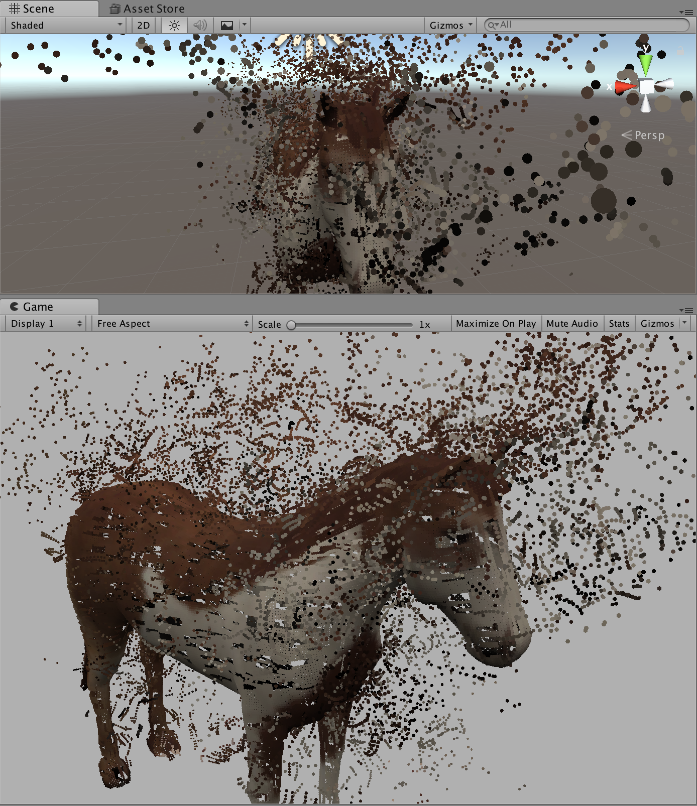

# ComputeShader-Unity-macOS

<a href="https://www.instagram.com/p/BaP31f6l_Cr/" >A post shared by すぎっちょ (@sugi_cho)</a> on Instagram.

## Related

- [sugi-cho/GPU-Particle](https://github.com/sugi-cho/GPU-Particle)
- [sugi-cho/SurfaceSamplerUnity](https://github.com/sugi-cho/SurfaceSamplerUnity)
- [sugi-cho/First-Compute-Shader](https://github.com/sugi-cho/First-Compute-Shader)
- [Metal Editor](https://forum.unity.com/threads/metal-editor.450548/)

MacだとUnityでGeometryShader使えない？？